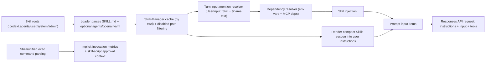

# Codex Skills Architecture and Implementation Plan

## 1. Goal
Document Codex's current skills architecture (codex-rs) so another engineer can reproduce equivalent behavior from scratch.

This write-up is implementation-oriented and includes:
- runtime architecture
- skill data model and source discovery
- model I/O behavior (instructions/input payload shape)
- explicit and implicit invocation flows
- dependency and approval controls
- caching/invalidation behavior
- end-to-end interaction example

## 2. Scope and Non-goals

### In scope
- `SKILL.md`-backed skills loaded from repo/user/system/admin roots
- optional `agents/openai.yaml` metadata
- model-facing skill listing in user instructions
- explicit skill invocation from user mentions/structured `Skill` input items
- implicit invocation detection for shell/unified-exec usage (analytics + approval path)
- dependency prompting (env vars / MCP)

### Out of scope
- Marketplace/distribution UX
- Plugin catalog install/update mechanics
- General tool-routing internals not needed for skills lifecycle

## 3. Canonical Behavior (Codex)
Codex skill behavior differs from Claude's `Skill` tool architecture in one key way:
- there is no dedicated `Skill` tool call in the model toolset for normal invocation
- Codex invokes skills by injecting selected `SKILL.md` contents as an extra user message when skills are explicitly mentioned

Progressive disclosure is implemented as:
1. include compact skill metadata list in AGENTS/user instructions context
2. inject full skill body only for explicitly selected/mentioned skills

## 4. High-Level Architecture



## 5. Skill Data Model
Codex runtime metadata shape (condensed):

```rust
struct SkillMetadata {
  name: String,
  description: String,
  short_description: Option<String>,
  interface: Option<SkillInterface>,        // display name, icons, brand color, default prompt
  dependencies: Option<SkillDependencies>,  // env_var / mcp dependency descriptors
  policy: Option<SkillPolicy>,              // allow_implicit_invocation
  permission_profile: Option<PermissionProfile>,
  permissions: Option<Permissions>,         // compiled runtime permissions
  path_to_skills_md: PathBuf,               // canonical path
  scope: SkillScope,                        // Repo/User/System/Admin
}
```

`SkillLoadOutcome` also carries:
- `skills`, `errors`
- `disabled_paths`
- implicit-invocation indexes:
  - by `scripts/` dir
  - by `SKILL.md` path

## 6. Source Layers and Root Discovery
Skill roots are assembled from config layers and repo ancestry:
- project-layer skills directories (`.../skills`) as repo scope
- user-layer directories (legacy and `$HOME/.agents/skills`) as user scope
- embedded system skills cache at `$CODEX_HOME/skills/.system` as system scope
- system config layer skills as admin scope
- repo-local `.agents/skills` discovered between project root and cwd

Then Codex:
- dedupes roots by canonical path
- scans breadth-first with depth and directory-count limits
- follows symlinked directories for repo/user/admin scopes (not system)

## 7. File Parsing and Metadata
Each skill requires `SKILL.md` frontmatter:
- required: `name`, `description`
- optional: `metadata.short-description`

Optional sidecar metadata:
- `agents/openai.yaml` can define:
  - `interface` (display metadata/icons/default prompt)
  - `dependencies` (tool dependencies, including env vars and MCP server descriptors)
  - `policy.allow_implicit_invocation`
  - `permissions`

Parse rules:
- sanitize single-line fields
- enforce max lengths
- canonicalize paths
- validate icon paths under `assets/`
- fail-open for optional `openai.yaml` (warn and continue)

## 8. Caching, Enable/Disable, and Reload
`SkillsManager` behavior:
- cache outcomes keyed by cwd
- allow forced reload
- derive `disabled_paths` from user `[[skills.config]]` entries
- build implicit invocation indexes only from enabled + policy-allowed skills

Invalidation:
- file watcher monitors registered skill roots
- `SkillsChanged` event clears skills cache
- next turn/load recomputes

## 9. Model-Facing Skill Listing (Metadata Stage)
At session setup:
1. skills are loaded for config/cwd
2. allow-implicit subset is computed
3. `render_skills_section(...)` appends a `## Skills` section to user instructions

That section includes:
- available skill `name: description (file: path)`
- usage rules for discovery/progressive disclosure/context hygiene

Important:
- model sees this compact listing in instructions context
- full `SKILL.md` content is not sent globally

## 10. Explicit Invocation Triggers
For each turn, Codex resolves explicit mentions from user inputs in order:
1. structured `UserInput::Skill { name, path }` by exact path match
2. text mentions (`$name`) and linked mentions (`[$name](path)`)

Selection rules:
- skip disabled skills
- path-linked mentions win on exact path match
- plain-name mention only when unambiguous:
  - exactly one enabled skill with that name
  - no connector slug collision
- preserve existing skill ordering semantics

## 11. Dependency Resolution Before Injection
Before injecting skill bodies:
- collect env-var dependencies from selected skills (`type: env_var`)
- resolve from session dependency cache, then process env vars
- prompt user for missing values (secret input), store in memory for session

MCP dependencies:
- compute missing MCP servers required by selected skills
- optionally prompt user to install
- on approval, persist into global MCP config and optionally perform OAuth login

## 12. Injection Protocol (Full Skill Body Stage)
For each selected skill:
- read `SKILL.md` from disk
- inject a user message with serialized skill payload

Injected message format:

```xml
<skill>
<name>demo</name>
<path>/abs/path/to/SKILL.md</path>
...full SKILL.md contents...
</skill>
```

If read fails:
- emit warning event
- continue turn without that skill body

## 13. How Model Request Payload Is Built
Codex request build uses:
- `instructions`: `prompt.base_instructions.text` (session/model base instructions)
- `input`: `prompt.get_formatted_input()` (conversation items)

`input` typically includes:
- developer instructions/messages
- AGENTS/user instructions message (containing Skills metadata section)
- environment context item
- user turn input
- injected `<skill>...</skill>` user message(s), when selected

So skills reach the model via regular conversation input items, not via a dedicated skill tool.

## 14. Implicit Invocation Path (Shell/Exec)
Codex also detects implicit skill usage from command execution:
- hooks in `shell_command` and `exec_command` handlers inspect command/workdir
- detect script runs under a skill `scripts/` directory
- detect direct reads of a skill `SKILL.md`

Current behavior of implicit path:
- emit skill invocation analytics/otel metrics
- dedupe per turn
- does not inject full skill body by itself

## 15. Skill Script Approval and Permissions
In zsh-fork escalation flow:
- if executed program is under `skill_root/scripts`, it is treated as skill script
- Codex prompts approval with skill-specific context
- `ApprovedForSession` is offered for skill script decisions
- skill permission profile can be attached as additional permissions for approval

This gives skill-script execution a stronger review boundary than normal shell policy fallback.

## 16. Error Handling and Robustness
Codex behavior is fail-open where safe:
- unreadable or malformed optional metadata (`openai.yaml`) -> warn, keep skill if possible
- malformed `SKILL.md` -> skip that skill, record load error
- inaccessible skill roots -> skip that root
- missing skill file at injection time -> warn, continue turn

## 17. Observability
Codex emits telemetry/events for:
- load failures and warnings
- skill injection status (`codex.skill.injected`)
- explicit/implicit skill invocations (analytics)
- dependency prompt/install paths
- file watcher skill-change events and cache clears

## 18. Implementation Plan (Parity-Oriented)

### Phase 1: Models and parser
- Implement `SkillMetadata`, `SkillLoadOutcome`, policy/dependency types.
- Parse `SKILL.md` frontmatter (`name`, `description`, short description).
- Add parser tests for validation/sanitization.

### Phase 2: Root discovery and loader
- Implement layered root discovery (repo/user/system/admin + `.agents/skills` ancestry).
- Implement bounded BFS scanning and dedupe by canonical path.
- Parse optional `agents/openai.yaml` metadata with fail-open semantics.

### Phase 3: Manager + cache + disable config
- Implement `SkillsManager` with cache by cwd and force-reload support.
- Implement disabled-path filtering from `[[skills.config]]`.
- Build implicit invocation indexes for enabled+allowed skills only.

### Phase 4: Instruction rendering
- Render compact skills list section and append to AGENTS/user instructions payload.
- Ensure no global full-body preload of all skills.

### Phase 5: Turn mention resolution + dependency prompts
- Resolve explicit skills from structured and text mentions.
- Add env-var dependency prompting and session cache.
- Add optional MCP dependency install prompt flow.

### Phase 6: Skill body injection + model payload
- Inject selected skill contents as user messages in `<skill>` format.
- Ensure request builder sends:
  - `instructions` = base instructions
  - `input` = conversation items + injected skill messages

### Phase 7: Implicit invocation + approval integration
- Add command-based implicit detection hooks in shell/exec handlers.
- Emit telemetry.
- Integrate skill-script specific approval affordances.

### Phase 8: Watcher and invalidation
- Watch skill roots for changes.
- Invalidate cached outcomes on changes.
- Verify reload behavior at next request.

## 19. Test Matrix

### Unit tests
- frontmatter parsing and length validation
- metadata parsing (`openai.yaml`) fail-open behavior
- root discovery ordering and dedupe
- mention extraction (`$name`, linked path mentions)
- ambiguity/collision handling (skill names vs connector slugs)

### Integration tests
- explicit turn with `UserInput::Skill` injects `<skill>` message
- env-var dependency prompt captures missing values
- MCP dependency prompt/install path
- disable via `[[skills.config]]` excludes skill
- skills list contains embedded system cache skills

### Runtime/loop contract tests
- request payload includes AGENTS instructions + skill metadata list
- selected skill injects only that skill body
- malformed skill does not crash turn
- implicit invocation emits telemetry without skill-body injection
- zsh-fork skill script path requires approval and exposes session-approval option

## 20. End-to-End Example (System/Instructions/Messages)
This example reflects Codex's actual flow.

### Initial context setup

`instructions` (base):
```text
<base model instructions...>
```

`input` includes user instructions item:
```text
# AGENTS.md instructions for /repo/path

<INSTRUCTIONS>
...project instructions...

## Skills
- db-migrate: Generate SQL migrations safely (file: ${CODEX_HOME}/skills/db-migrate/SKILL.md)
- release-checks: Pre-release validation checklist (file: ${CODEX_HOME}/skills/release-checks/SKILL.md)
...
</INSTRUCTIONS>
```

### Turn: user asks for a skill
User message:
```text
Use $db-migrate to add an index on users(email).
```

Resolver selects `db-migrate`, reads `SKILL.md`, injects:
```xml
<skill>
<name>db-migrate</name>
<path>${CODEX_HOME}/skills/db-migrate/SKILL.md</path>
---
name: db-migrate
description: ...
---
...skill instructions...
</skill>
```

### Request sent to model
```json
{
  "instructions": "<base model instructions...>",
  "input": [
    {"role": "user", "content": "# AGENTS.md instructions ... ## Skills ..."},
    {"role": "user", "content": "<environment_context>...</environment_context>"},
    {"role": "user", "content": "Use $db-migrate to add an index on users(email)."},
    {"role": "user", "content": "<skill>...</skill>"}
  ],
  "tools": [...],
  "tool_choice": "auto"
}
```

### Back-and-forth sample
1. User: "Use `$db-migrate` to add an index on users(email)."
2. Codex: detects skill mention, injects skill body, model proposes migration command.
3. Assistant/tool call: runs migration generation tool/command.
4. Tool output returned to model.
5. Assistant: returns summary and next actions.

If dependency missing (for example `DATABASE_URL`):
1. User mentions skill.
2. Codex prompts user for missing env var via request-user-input.
3. User provides value.
4. Codex retries turn with injected skill + dependency env present.

## 21. Acceptance Criteria
Implementation is complete when:
1. skills are discovered from layered roots with deterministic dedupe
2. model sees compact skill metadata in instructions context
3. full skill body is sent only for explicitly selected/mentioned skills
4. dependency prompt paths (env/MCP) work before injection
5. disable/enable and watcher-based cache invalidation work
6. implicit skill detection emits telemetry and script approvals behave as designed

## 22. Practical Notes
- Keep full skill body loading lazy; metadata list is enough for discovery.
- Preserve path canonicalization and per-cwd cache boundaries.
- Treat mention-resolution ambiguity as a hard filter (skip ambiguous names).
- Keep invocation logic separate from parsing/loading logic for testability.
