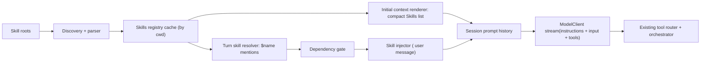

# PyCodex Skills Plan

Last updated: 2026-03-08 (rev 3 — reflects shipped v1)

## Purpose

Define a skills system for pycodex that balances simplification and feature completeness.
This document is implementation-oriented and reflects the shipped v1 implementation.

## Primary Outcomes

1. Add skills without breaking current pycodex runtime contracts in `engineering-plan.md`.
2. Keep v1 simple: explicit invocation, lazy loading, deterministic behavior.
3. Preserve a clear path to v2/v3 completeness (model-invoked skills, dynamic activation, richer dependency flows).

## Goals

1. Support markdown-defined skills (`SKILL.md`) with deterministic metadata parsing.
2. Discover skills from layered roots with canonical dedupe and stable precedence.
3. Expose compact skill metadata to the model at session startup.
4. Inject full skill instructions only for explicitly selected skills.
5. Keep tool routing and approval orchestration unchanged in v1.
6. Make failure behavior deterministic and fail-open where safe.
7. Provide a high-signal test matrix that validates behavior contracts.

## Non-Goals (v1)

1. Do not make a new model-visible `Skill` tool the primary invocation path.
2. Do not implement forked sub-agent execution for skills.
3. Do not implement plugin marketplace install/update mechanics.
4. Do not add filesystem watchers or dynamic path activation in v1.
5. Do not change existing protocol events unless strictly needed.
6. No implicit skill activation or path-linked invocation form.
7. No `agents/openai.yaml` sidecar metadata — all metadata lives in `SKILL.md` frontmatter.

## Existing Architecture Constraints

These constraints come from the current pycodex architecture and must remain true in v1:

1. `Session` is the only owner of prompt history mutation (`pycodex/core/session.py`).
2. Agent loop remains sequential for tool dispatch (`pycodex/core/agent.py`, `pycodex/core/AGENTS.md`).
3. `ToolAborted` remains terminal for the active turn.
4. Tool approval and sandboxing remain centralized in `pycodex/tools/orchestrator.py`.
5. `profile.instructions` is stable instruction policy; initial-context system messages carry dynamic environment/project context.
6. Rollout replay and resume must remain deterministic.

## Design Summary

V1 uses a Codex-style progressive disclosure model aligned with pycodex:

1. Stage A (metadata): append a compact `## Skills` inventory to initial context system content.
2. Stage B (full body): when user explicitly invokes a skill, inject that skill as a synthetic user message before model sampling.
3. Keep existing tools (`shell`, `write_file`, etc.) as the only executable path.

This gives low implementation risk, good token efficiency, and strong extensibility.

## Architecture



## Core Design Decisions

### Decision 1: Explicit `$name` mention invocation only

- Decision: skills are invoked via explicit `$skill-name` mention only. No path-linked form, no model-invoked tool.
- Why: avoids expanding tool contracts and agent loop control flow in v1. Path-linked form adds parser surface and security edge cases for negligible user value.
- Tradeoff: model has less autonomous skill invocation power; no direct path disambiguation.

### Decision 2: Two-channel prompt strategy

- Decision: put stable skills policy in `profile.instructions`; put dynamic catalog in initial-context system message.
- Why: stable policy belongs in `instructions`; inventory is environment-dependent and should be persisted/replayed in history.
- Tradeoff: duplicate conceptual context split across two channels.

### Decision 3: Lazy full-body loading only

- Decision: do not preload all `SKILL.md` bodies globally.
- Why: token efficiency and lower prompt pollution.
- Tradeoff: requires resolver/injector step per turn.

### Decision 4: Single metadata source — `SKILL.md` frontmatter only

- Decision: all skill metadata (name, description, dependencies) lives in `SKILL.md` frontmatter. No `agents/openai.yaml` sidecar.
- Why: sidecar doubles parsing pathways and failure surface. Single file is easier to author and review.
- Tradeoff: frontmatter is slightly denser. Mitigation: reintroduce sidecar in v2 if concrete need arises.

### Decision 5: No watcher in v1

- Decision: cache by cwd with explicit reload semantics; no file watcher in v1.
- Why: simpler state model and fewer race conditions.
- Tradeoff: skill edits are visible on next cache reload boundary.

### Decision 6: Typed Config fields

- Decision: skill configuration fields (`skill_dirs`, `skills_user_root`, `skills_system_root`, `skills_manager`) are explicit typed fields on `Config`, not probed via `getattr`.
- Why: deterministic behavior; no silent degradation when fields are missing.
- Tradeoff: minor schema change required.

## Skill Definition

### Required file layout

Each skill is a directory containing `SKILL.md`.

Example:

```text
.agents/skills/db-migrate/
  SKILL.md
  scripts/generate.sh           # optional — shell helpers
  assets/icon.svg               # optional — display assets
```

### `SKILL.md` contract (v1)

Required frontmatter fields:

1. `name: str`
2. `description: str`

Optional frontmatter fields:

1. `metadata.short-description` — short label for compact catalog display
2. `dependencies.env_vars` — list of required environment variable names

Body:

1. Treated as the full skill instruction payload.
2. Injected verbatim (with minimal framing) when selected.

Example:

```md
---
name: db-migrate
description: Generate SQL migrations with rollback and verification.
metadata:
  short-description: Safe migration workflow
dependencies:
  env_vars:
    - DATABASE_URL
---
When invoked:
1. Inspect schema and constraints.
2. Propose up/down SQL.
3. Add a verification query.
```

Dependency parse behavior:

1. Malformed `dependencies` field warns and continues with `dependencies: None` (fail-open).
2. Warnings are collected on `ParsedSkillDocument.warnings` and emitted as `skill.load_warning` events during discovery.

## Registry and Discovery

### Registry responsibilities

1. Provide enabled skill set for a cwd.
2. Provide deterministic lookup by name and by absolute path.
3. Carry load warnings and disabled-path diagnostics.

### Types

```python
@dataclass(frozen=True)
class SkillMetadata:
    name: str
    description: str
    short_description: str | None
    path_to_skill_md: Path
    skill_root: Path
    scope: Literal["repo", "user", "system"]
    dependencies: SkillDependencies | None

@dataclass(frozen=True)
class SkillDependencies:
    env_vars: tuple[SkillEnvVarDependency, ...]

@dataclass(frozen=True)
class SkillEnvVarDependency:
    name: str

@dataclass(frozen=True)
class SkillLoadOutcome:
    skills: tuple[SkillMetadata, ...]
    errors: tuple[str, ...]
    disabled_paths: tuple[Path, ...]
```

### Root precedence (v1)

V1 defines three scopes: `repo`, `user`, `system`. Admin scope is not supported in v1.

Discovery order (highest to lowest precedence):

1. Repo scope: `.agents/skills` directories found walking from repo root to cwd (ancestor chain).
2. Repo scope: project-configured skill dirs from `Config.skill_dirs` (or `pycodex.toml`); treated as repo scope.
3. User scope: `Config.skills_user_root` (default: `$HOME/.agents/skills`).
4. System scope: `Config.skills_system_root` (default: `$PYCODEX_HOME/skills/.system`).

### Discovery algorithm

1. Collect roots in precedence order.
2. Canonicalize (`Path.resolve`) and dedupe roots.
3. Bounded traversal (depth and directory-count limits).
4. Accept directories containing `SKILL.md`.
5. Parse `SKILL.md` frontmatter; collect any dependency parse warnings.
6. Canonicalize skill path and dedupe conflicts deterministically.
7. Build indexes: by name, by path.

Conflict handling:

1. If same canonical skill path appears twice, keep first and record warning.
2. If same name appears across different scopes, resolve by scope precedence (repo > user > system): keep the highest-precedence skill and record a debug log. Do not mark as ambiguous.
3. If same name appears within the same scope (true duplicate), keep first encountered and mark name as ambiguous so plain-name mentions are rejected with a deterministic warning.

## Invocation Model

### Invocation trigger

v1 supports one explicit trigger: `$skill-name` mention in user text.

Future optional triggers (v2):

1. Path-linked form `[$name](/path)` — deferred; adds security surface for marginal user value.
2. Structured input item from TUI/client.

### Mention extraction rules

Apply to raw user text before registry lookup:

1. Pattern: `\$([a-zA-Z0-9][a-zA-Z0-9_-]*)` — dollar sign followed by an identifier starting with an alphanumeric character.
2. Name terminates at the first character that is not `[a-zA-Z0-9_-]` (space, punctuation, newline, end of string).
3. Skip mentions inside fenced code blocks (triple backtick or triple tilde) and inline code spans (single backtick).
4. Duplicate mentions of the same name in one user message inject the skill exactly once.

`SkillMention` carries only `name: str` — no position tracking, no path field.

### Turn-time invocation sequence

1. Receive user input.
2. If `$` not in input, skip skill resolution entirely (fast path).
3. Extract `$name` mention candidates from user text using the extraction rules above.
4. Resolve mentions against current registry:
   - Plain name resolves when exactly one enabled skill matches (cross-scope already resolved by precedence at registry build time; only same-scope true duplicates remain ambiguous).
   - Ambiguous plain names produce `<skill-unavailable reason="ambiguous name">`.
   - Unknown names produce `<skill-unavailable reason="skill not found">`.
5. Resolve dependencies for each resolved skill.
6. Inject selected skills as synthetic user messages in this order:
   - First, any `<skill-unavailable>` messages (ambiguity, not-found, or dependency failure).
   - Then, one `<skill>` message per successfully resolved skill, in mention-appearance order.

```xml
<skill>
<name>db-migrate</name>
<path>/abs/path/to/SKILL.md</path>
...full SKILL.md contents...
</skill>
```

7. Each injected message is tagged with `role: "user"` and carries `skill_injected: true`, `skill_name`, `skill_path`, and `skill_reason` in session metadata.
8. Run normal `model_client.stream(...)` with unchanged tools list.

### Placement of stable policy vs dynamic catalog

1. Stable skills policy text goes into `profile.instructions` (or profile override).
2. Dynamic `## Skills` catalog goes into initial-context system message so it is session-scoped, replayable, and cwd-specific.

### `## Skills` section format contract

If zero enabled skills exist, omit the `## Skills` section entirely — emit no heading, no placeholder text.

If one or more enabled skills exist, append the following block to the initial-context system message:

```text
## Skills

The following skills are available. Mention `$skill-name` to invoke a skill.
Use only skills listed here. Do not guess skill names.

- <name>: <description>[ — <short-description>]
- <name>: <description>
...
```

Formatting rules:

1. One bullet per enabled skill, in registry order (precedence order, then discovery order within a scope).
2. Include `short-description` appended with ` — ` only if present; omit otherwise.
3. Truncation budget: if total section length exceeds 2000 characters, truncate the list at the last complete bullet that fits and append `(and N more — use $skill-name by exact name to invoke)`.
4. Do not include `path`, `arguments`, or `when-to-use` in this listing — metadata only.

## Dependencies and Approval Integration

### Dependency gate (v1)

Supported first-class dependency type: `env_var` requirements declared in `SKILL.md` frontmatter.

Behavior:

1. If required env var exists in process env, mark satisfied.
2. If missing, do NOT silently skip. Inject a `<skill-unavailable>` message before the model sample:

```xml
<skill-unavailable>
<name>db-migrate</name>
<reason>missing required env var: DATABASE_URL</reason>
</skill-unavailable>
```

3. Log the failure at `WARNING` level (see Observability).
4. Optional interactive prompting for missing values is deferred to v2.

Deferred to v2:

1. MCP server install/login orchestration.

### Approval integration

1. Keep all execution within existing tools/orchestrator pipeline.
2. For commands under `skill_root/scripts`, enrich approval preview with skill context.
3. Preserve existing approval key semantics and session-scoped approvals.

## Error Handling Contracts

1. Skill load errors are non-fatal and aggregated.
2. Malformed `SKILL.md` excludes only that skill.
3. Malformed optional `dependencies` field in frontmatter warns and continues with `dependencies: None`.
4. Unknown skill name in user mention injects `<skill-unavailable>` with `reason: skill not found`.
5. Resolved skill whose file cannot be read at injection time injects `<skill-unavailable>` with `reason: file not found`.
6. Invocation ambiguity never silently chooses a random skill; injects `<skill-unavailable>` with `reason: ambiguous name`.
7. Dependency failure never crashes a turn; injects `<skill-unavailable>` with `reason: missing required env var: VAR_NAME`.
8. All `<skill-unavailable>` messages are injected before any `<skill>` messages in the same turn so the model reads failures before instructions.

## Security and Safety

1. Canonicalize all paths before registration/invocation.
2. Reject path traversal outside allowed roots for discovered skills.
3. Redact sensitive values in any skill-related previews/logs.
4. Never execute skill files directly; only inject instructions or run explicit shell tools under existing approvals.

## Replay and Resume

Injected skill messages are persisted as normal session history items. On resume, the agent must not re-inject skills that were already injected in the replayed turn. The contract:

1. Each synthetic message (both `<skill>` and `<skill-unavailable>`) carries `skill_injected: true`, `skill_name`, `skill_path`, and `skill_reason` in its session metadata envelope (not in message content).
2. Before injecting skills for a turn, the agent scans backward from the second-to-last history item, collecting consecutive `skill_injected: true` messages immediately preceding the newly appended user message. These represent already-injected skills from a prior interrupted attempt.
3. If a matching key `(name, path, reason)` is found in that set, skip injection for that skill.
4. If not found, inject normally.

This approach is content-independent: it does not rely on matching user message text, so it correctly handles both resume and the case where a user sends the same message text in a fresh turn.

## Observability

Emit structured log events for all skill lifecycle actions. Use Python `logging` with a `pycodex.skills` logger hierarchy. All events include `name` and `scope` where applicable.

| Event | Level | Fields |
|---|---|---|
| `skill.loaded` | `DEBUG` | `name`, `scope`, `path` |
| `skill.load_error` | `WARNING` | `path`, `reason` |
| `skill.load_warning` | `WARNING` | `path`, `reason` (dependency parse failure) |
| `skill.dedup_skipped` | `DEBUG` | `name`, `scope`, `kept_path`, `skipped_path` |
| `skill.injected` | `INFO` | `name`, `scope`, `path` |
| `skill.unavailable` | `WARNING` | `name`, `reason` |
| `skill.replay_skip` | `DEBUG` | `name`, `path` (skipped on resume) |

No skill body content, env var values, or secret-adjacent fields are included in any log event.

## Implementation

All phases are shipped. Files:

| File | Responsibility |
|---|---|
| `pycodex/core/skills/models.py` | `SkillMetadata`, `SkillLoadOutcome`, `SkillDependencies`, `SkillEnvVarDependency` |
| `pycodex/core/skills/parser.py` | `SKILL.md` frontmatter parser (hand-rolled YAML subset); dependency extraction; fail-open warnings |
| `pycodex/core/skills/discovery.py` | Root collection, BFS scan, canonical dedupe, conflict handling |
| `pycodex/core/skills/manager.py` | `SkillsManager` cache keyed by `(cwd, fingerprint)`; `SkillRegistry` with `by_name`/`by_path` indexes |
| `pycodex/core/skills/resolver.py` | `$name` mention extraction, code-fence masking, registry resolution |
| `pycodex/core/skills/render.py` | Compact `## Skills` section with 2000-char budget truncation |
| `pycodex/core/skills/injector.py` | Turn-time `<skill>` / `<skill-unavailable>` message builder; env-var dependency gate |
| `pycodex/core/initial_context.py` | Skills catalog appended to project instructions at startup |
| `pycodex/core/agent.py` | `_inject_turn_skill_messages()` wired into `run_turn()`; replay-dedupe via backward history scan |
| `pycodex/core/config.py` | Typed `skill_dirs`, `skills_user_root`, `skills_system_root`, `skills_manager` fields |

## Test Matrix

### Unit

1. Frontmatter parsing and validation (required fields, body extraction).
2. Dependency parse from `SKILL.md` frontmatter: env_vars list and mapping shapes, deduplication.
3. Dependency parse fail-open: malformed `dependencies` field warns, returns `None`.
4. Root ordering and dedupe.
5. Mention extraction: `$name` in prose, mentions in fenced code blocks and inline code are excluded.
6. Mention extraction: duplicate `$name` in same message produces exactly one resolved skill.
7. Injection payload formatting (`<skill>`, `<skill-unavailable>`).
8. Conflict resolution: same name across scopes resolves by precedence, not marked ambiguous.
9. Conflict resolution: same name within same scope marked ambiguous.
10. `## Skills` section format: correct bullet format, short-description inclusion, truncation at 2000 chars with count suffix.
11. `## Skills` section: omitted entirely when no skills exist.

### Integration

1. Startup context includes compact `## Skills` section with correct format.
2. Startup context emits no `## Skills` section when skill set is empty.
3. Explicit mention injects only selected skill body.
4. Unknown name mention injects `<skill-unavailable reason="skill not found">`.
5. Dependency failure injects `<skill-unavailable>` with correct reason; model turn continues.
6. Ambiguity injects `<skill-unavailable>` with correct reason; other skills in same turn still inject.
7. `<skill-unavailable>` messages appear before `<skill>` messages in same turn.
8. Malformed skill does not crash turn.

### Harness/behavior

1. End-to-end explicit skill mention flow.
2. Ambiguous mention: `<skill-unavailable>` injected, model explains to user.
3. Dependency failure: `<skill-unavailable>` injected, model explains missing env var.
4. Resume/replay: injected skill messages are not re-injected on session resume.

### Rollout and Compatibility

1. No schema version bump required for v1.
2. Injected skill payloads are persisted as normal history items.
3. Existing CLI/TUI commands remain unchanged.
4. Default behavior when no skills exist: no-op, no warnings.

## Future Improvements

### V2 candidates

1. Optional model-invoked `Skill` tool path (secondary to explicit mention path).
2. MCP dependency install/login flow.
3. File watcher-based cache invalidation and dynamic discovery.
4. Path-linked invocation form `[$name](/path)` for disambiguation.
5. Protocol events for skills (`skill.applied`, `skill.warning`) with Python/TS lockstep updates.
6. Per-skill permission profiles attached to approval requests.
7. `agents/openai.yaml` sidecar for advanced runtime metadata (interface hints, policy overrides).

### V3 candidates

1. Forked execution mode for long-running specialist skills.
2. Dynamic activation by touched paths.
3. Ranking/retrieval heuristics for large skill catalogs.
4. Skill analytics and success/failure telemetry dashboards.

## Acceptance Criteria

All shipped and verified:

1. Skills discovered from configured roots with deterministic ordering and dedupe.
2. Model sees compact `## Skills` metadata catalog at session startup; section is omitted when no skills exist.
3. Full skill body is injected only for explicitly selected skills, in mention-appearance order.
4. Unknown names, ambiguity, and dependency failures surface to the model as `<skill-unavailable>` messages, not silent skips.
5. `<skill-unavailable>` messages always precede `<skill>` messages in the same turn.
6. Session resume does not re-inject skill messages already present in history.
7. Observability log events emitted for load, inject, warning, and replay-skip actions.
8. Existing agent/tool/orchestrator contracts remain intact.
9. All targeted tests pass (`pytest tests/core/skills/ tests/core/test_agent.py tests/core/test_initial_context.py`).
